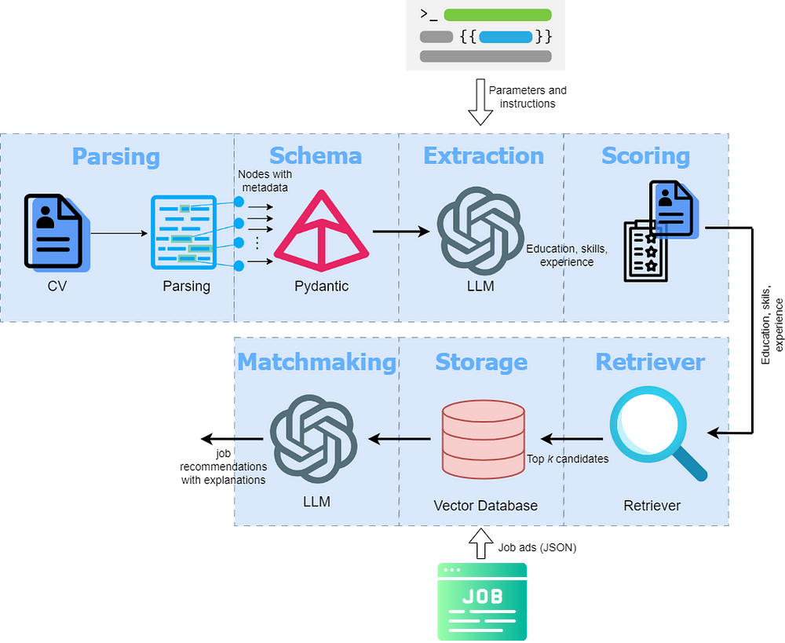
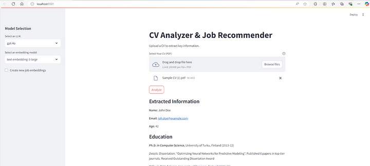
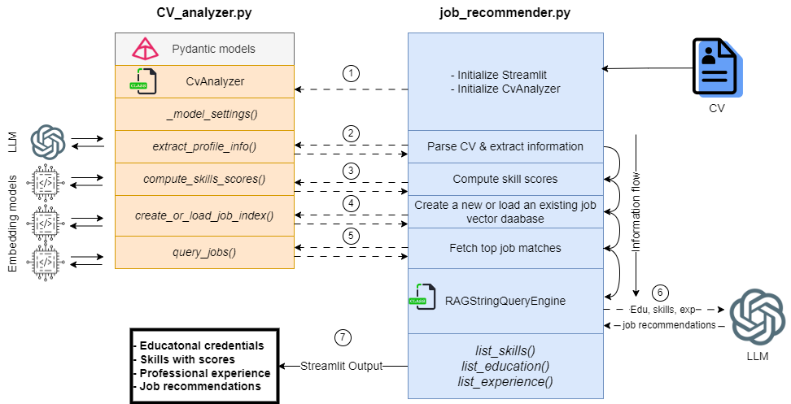

**This application is based on [my article in Towards Data Science](https://towardsdatascience.com/ai-powered-information-extraction-and-matchmaking-0408c93ec1b9).**

# CV Analyzer and Job Recommender

This tool analyzes a CV and extracts key information, scores the extracted skills, and suggests suitable jobs from a job ad database.  

There are two folders: 
1. **OpenAI models**: the code in this folder uses OpenAI's gpt-4o large language model, and text-embedding-3-large embedding model
2. **Mutiple models**: the code in this folder offers to select multiple models including open-source and OpenAI's large language models and embedding models.  

If you have a powerful computing machine with a GPU, you can try the code in **Multiple models** for comapring the performance of multiple models. If you prefer to use only OpenAI models, you need to run the code in **OpenAI models**. In that case you will need OpenAI's API keys. 

The instructions to use the codes in both the folders are present in their respective folders. 

## Tool Features
The tool is flexible to choose between open-source large language models or OpenAI's advanced models, organized within the "Multiple models" folder. CV parsing is handled using LlamaParse, enabling structured extraction of data from resumes.  

The tool utilizes Pydantic models with a large language model for information extraction (personal, skills, experience, education) from CVs. A scoring mechanism assesses skills and the results are displayed in a user interface.  The tool provides job recommendations by matching the extracted information from a resume with relevant job ads in a curated job dataset. 

## Overall Process
The following figure shows the overall process.  

<p align="center">
  
  <br>
  <em>Overall process of parsing a resume, scoring skills, and matching education, experience and skills with a vector database to suggest matching jobs.</em>
</p>  

Following is the screenshot of the streamlit app:  

<p align="center">
  
  <br>
  <em>A snapshot of the streamlit application</em>
</p>  

Here is the application's workflow:
<p align="center">
  
  <br>
  <em>A snapshot of the streamlit application</em>
</p>

# How to Use the Code.

Clone the repository:
   ```
   git clone https://github.com/umairalipathan1980/CV-Analyzer-Job-Recommender.git
   cd CV-Analyzer-Job-Recommender
   ```
## For OpenAI Models  

For using **only OpenAI models**, nagivate to the folder **OpenAI models**. This code uses `gpt-4o` large langugae model and 'text-embedding-3-large' embedding model. 

**1. Install dependencies:**
   ```
   pip install llama-index openai pydantic[email] streamlit llama_parse
   ```

**2. Create a folder ".streamlit" in the root directory and create a "secrets.toml" file in it. Set your API keys there as follows:**
   ```
   OPENAI_API_KEY = "your_OPENAI_api_key"
   LLAMA_CLOUD_API_KEY = "your_llama_cloud_api_key"
   ```

**3. Run the Streamlit app:**
   ```
   python -m streamlit run .\job_recommender.py  
   ```
The job dataset is in the folder 'job_index_storage'. To create a new vector database for modified job dataset, just delete the folder 'job_index_storage'. A new vector database will be created. Whenever the job dataset in the JSON file *sample_jobs* will change, a new vector database will have to be created. 

## For Selecting OpenAI or Open-Source Models

For selecting OpenAI or open-source models (such as llama), navigate to the folder **Multiple models**. From there, you can select a large language model and an embedding model. In this case, you will need to install additional libraries.  

## 1. Install dependencies:
   ```
   pip install llama-index openai pydantic[email] streamlit llama-index-llms-ollama llama-index-embeddings-huggingface transformers
   ```
   **Install *torch* for CPU-version (if you do not have a GPU):**
   ```
   pip install torch torchvision torchaudio
   ```
   **Install *torch* for GPU-version (if you have a CUDA-enabled GPU for faster processing). Here, we assume that CUDA toolkit is already installed and configured on your machine.** 
   ```
   pip install torch torchvision torchaudio --index-url https://download.pytorch.org/whl/cu<CUDA_VERSION>
   ```
   Here **<CUDA_VERSION>** refers to the CUDA version on your PC. For example, on my machine, the CUDA version is 12.6, so I will run the following code:  
   ```
   pip install torch torchvision torchaudio --index-url https://download.pytorch.org/whl/cu118
   ```
   **Install Ollama from their official website (https://ollama.com/)** 
   **Pull an open-source model from Ollama before using it in the application. For instance, use the following code to pull `llama3.3:latest`.
   ```
   ollama pull llama3.3:latest
   ```
   
## 2. Set up API keys:
   Create a folder ".streamlit" in the root directory and create a "secrets.toml" file in it. Set your API keys there as follows:
   ```
   OPENAI_API_KEY = "your_OPENAI_api_key"
   LLAMA_CLOUD_API_KEY = "your_llama_cloud_api_key"
   ```
## 3. Run the Streamlit app:
   ```
   python -m streamlit run .\job_recommender.py
   ```
The job vector database is in the folder 'job_index_storage', created using 'text-embedding-3-large' embedding model. However, you can create a new vector database for a selected model by selecting *create new job embeddings* from the left bar. Whenever the job dataset in the JSON file *sample_jobs* will change or a new embedding model will be selected, a new vector database will have to be created. 


